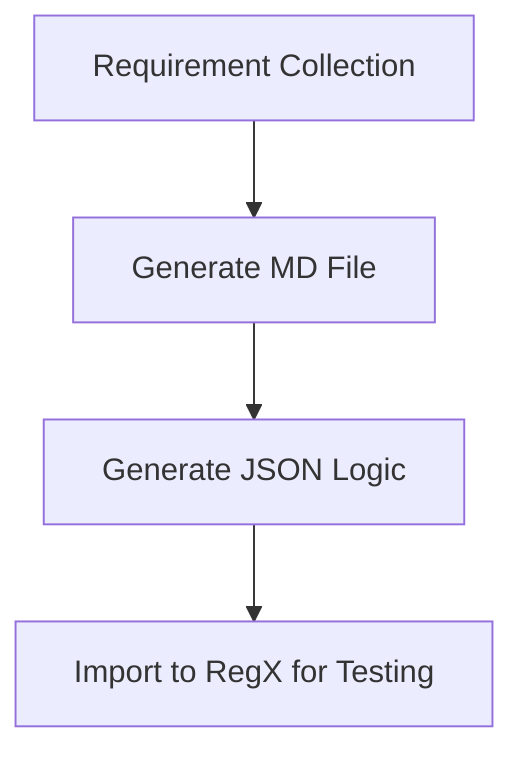

# Report Development Workflow

## Overview
This document describes the standard workflow for report development, including requirement collection, document transformation, logic generation, and testing.

## Workflow Steps

### Step 1: Requirement Collection
- Use Excel template to collect business requirements
- Template includes report fields, data sources, calculation logic, filtering conditions, etc.
- Ensure completeness and accuracy of requirements

### Step 2: Generate MD File
- Convert Excel requirement file to Markdown format
- MD file structurally displays report requirements
- Facilitates parsing and transformation in subsequent steps

### Step 3: Generate JSON Logic
- Parse report logic from MD file
- Convert to JSON format report configuration
- Includes data queries, calculation formulas, display rules, etc.

### Step 4: Import to RegX for Testing
- Import JSON configuration to RegX testing platform
- Execute report generation and verification
- Ensure output meets requirement specifications

## Tools and Templates
- Excel requirement template: [To be provided]
- MD conversion script: [To be developed]
- JSON generator: [To be developed]
- RegX testing environment: [To be configured]

## Notes
- Each step should have clear input/output validation
- Maintain file version consistency
- Test coverage for all business scenarios